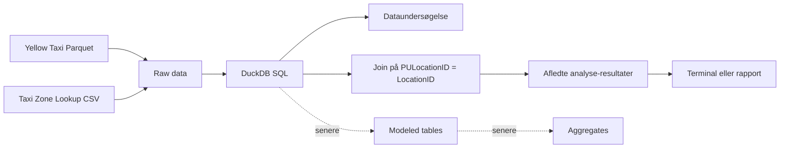
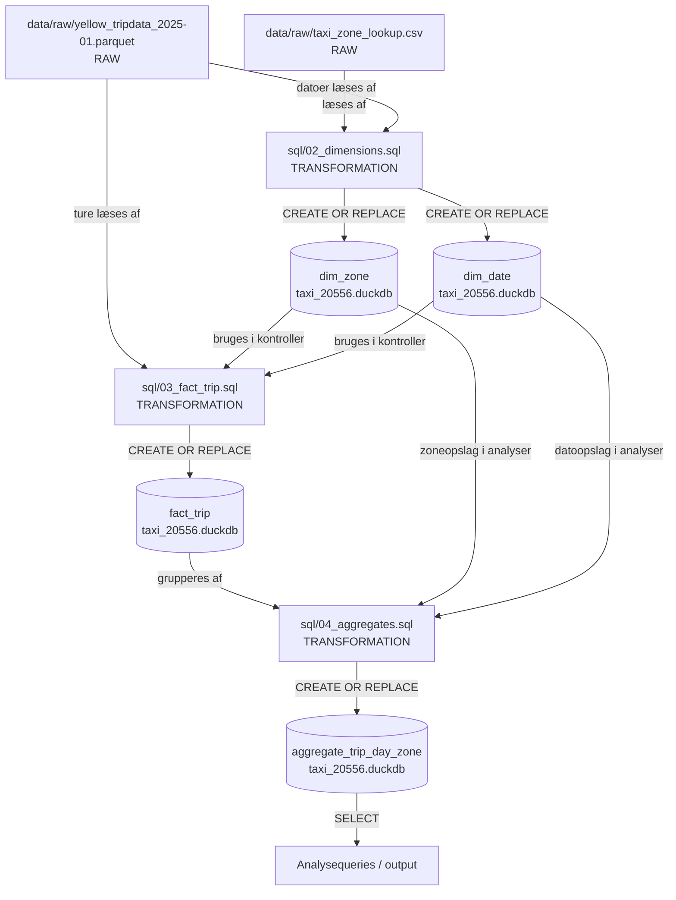
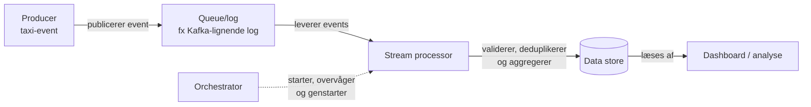
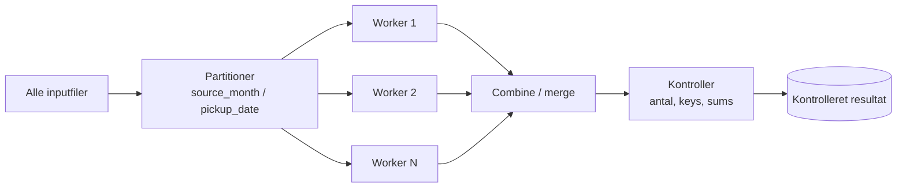

# Arkitektur

**Version 1.0**

## Indhold

1. [Data](#data)
2. [Analysebehov](#analysebehov)
3. [Arkitekturskitse](#arkitekturskitse)
4. [Teknologier](#teknologier)
5. [Kilder](#kilder)
6. [Dag03 – aggregate, lagring og genskabelse](#dag03--aggregate-lagring-og-genskabelse)
7. [Dag04 – processing og pipeline](#dag04--processing-og-pipeline)

## Data

**Yellow Taxi:** Hver række i datasættet er én færdig taxitur. Der er blandt
andet information om tidspunkt, pickup- og dropoff-zone, distance, betaling og
antal passagerer.

**Taxi Zone Lookup:** Hver række er én taxi-zone. `LocationID` bruges til at
koble zonerne sammen med `PULocationID` og `DOLocationID` fra taxiturene.

### Relevante felter

- `tpep_pickup_datetime`: Tidspunktet hvor turen starter.
- `tpep_dropoff_datetime`: Tidspunktet hvor turen slutter.
- `PULocationID`: ID'et på pickup-zonen.
- `DOLocationID`: ID'et på dropoff-zonen.
- `trip_distance`: Hvor langt turen var i miles.
- `fare_amount`: Grundprisen på turen før ekstra beløb.

Jeg brugte
[NYC TLC Yellow Taxi Data Dictionary](https://www.nyc.gov/assets/tlc/downloads/pdf/data_dictionary_trip_records_yellow.pdf)
til at finde ud af, hvad felterne betyder.

Zone Lookup-filen indeholder blandt andet:

- `LocationID`: ID'et på zonen.
- `Borough`: Hvilken bydel zonen ligger i.
- `Zone`: Navnet på zonen.
- `service_zone`: Hvilken servicezone den hører til.

Jeg tjekkede joinet ved at sammenligne antal rækker før og efter joinet og
også ved at se efter zone-ID'er, som ikke kunne matches. I det datasæt jeg
bruger, kunne alle pickup-zone-ID'er matches med en `LocationID`.

Jeg bruger stadig `LEFT JOIN`, fordi jeg så ikke mister taxiture, hvis der
senere kommer data med et zone-ID, som ikke findes i lookup-filen.

## Analysebehov

Jeg vil kunne bruge dataene til at svare på disse spørgsmål:

1. Hvilke pickup-zoner har flest taxiture?
2. Hvilke boroughs har flest ture, og hvor lang er den gennemsnitlige tur?
3. Hvordan ændrer antal ture og gennemsnitlig distance sig over tid?

Zone Lookup bruges blandt andet til spørgsmål nummer 2, fordi
`PULocationID` kan kobles sammen med `LocationID`, `Borough` og `Zone`.

## Arkitekturskitse



### Dataflow

Parquet-filen og CSV-filen er mine raw-filer, og de ligger uændret i
`data/raw/`.

Parquet-filen indeholder selve taxiturene, mens CSV-filen indeholder
oplysninger om taxi-zonerne. DuckDB bruges til at læse begge filer og køre SQL
på dem.

Joinet mellem dem ser sådan ud:

```text
yellow_tripdata.PULocationID = taxi_zone_lookup.LocationID
```

Resultater som antal ture pr. zone, gennemsnitlig distance pr. borough og antal
ture pr. måned er afledte data. Det vil sige, at de bliver beregnet ud fra
raw-data og ikke findes direkte i de originale filer.

Først arbejdede jeg med at læse raw-filerne, undersøge dataene, gruppere dem og
joine med Zone Lookup. Senere blev `dim_zone`, `dim_date` og `fact_trip`
bygget, og derefter blev der lavet aggregate og pipeline.

## Teknologier

Yellow Taxi-dataene ligger i Parquet-format. Zone Lookup ligger som CSV.

Jeg bruger DuckDB som database og SQL-engine, fordi den kan læse Parquet og CSV
direkte, og fordi den fungerer godt til analysequeries.

Databasefilen ligger her:

```text
data/warehouse/taxi_20556.duckdb
```

Her ligger de tabeller, jeg bygger undervejs.

Raw-data betyder de originale filer, som jeg ikke ændrer på. Afledte data er
de tabeller og resultater, som bliver lavet ud fra raw-data med SQL, for
eksempel joins, optællinger og gennemsnit.

## Kilder

- [NYC TLC Trip Record Data](https://www.nyc.gov/site/tlc/about/tlc-trip-record-data.page)
- [Yellow Taxi Data Dictionary](https://www.nyc.gov/assets/tlc/downloads/pdf/data_dictionary_trip_records_yellow.pdf)
- [DuckDB: Reading and Writing Parquet Files](https://duckdb.org/docs/current/data/parquet/overview)
- [DuckDB: CSV](https://duckdb.org/docs/current/data/csv/overview)
- [DuckDB: FROM and JOIN](https://duckdb.org/docs/current/sql/query_syntax/from)
- [DuckDB: Why DuckDB](https://duckdb.org/why_duckdb)

## Dag03 – aggregate, lagring og genskabelse

### Aggregate og informationstab

På Dag03 arbejdede jeg videre med at lave et aggregate, så det bliver nemmere
at analysere antal ture og gennemsnitlig distance over tid.

Grain i `fact_trip` er én række pr. taxitur.

Grain i `aggregate_trip_day_zone` er én række pr. pickup-dato og pickup-zone.

Det betyder, at aggregate-tabellen har færre detaljer end `fact_trip`. Den
gemmer disse værdier:

- `trip_count`: hvor mange ture der er
- `distance_sum`: samlet distance
- `distance_count`: hvor mange ture der har en distanceværdi

Jeg gemmer både `distance_sum` og `distance_count`, fordi gennemsnittet så kan
beregnes korrekt senere.

For eksempel:

```text
SUM(distance_sum) / SUM(distance_count)
```

Aggregate-tabellen kan derfor bruges til spørgsmål som:

> Hvor mange ture og hvad var den gennemsnitlige distance pr. pickup-zone og måned?

Til gengæld kan den ikke bruges til at se detaljer om enkelte ture, for
eksempel betalingsform eller det præcise totalbeløb på en bestemt tur. Den
information er blevet samlet væk.

Man kan heller ikke bare tage gennemsnittet af flere gennemsnit. Hvis én gruppe
har 10 ture og en anden har 10.000 ture, skal de ikke tælle lige meget.
Derfor bruger jeg sum og count.

I `sql/04_aggregates.sql` har jeg lavet kontroller, som blandt andet tjekker:

- at samme aggregate-grain ikke findes flere gange
- at antal ture passer med `fact_trip`
- at antal distanceværdier passer
- at afstandssummen passer
- at NULL og distance 0 bliver undersøgt hver for sig
- at en genkørsel ikke laver ekstra rækker
- at resultatet kan sammenlignes med `fact_trip`

### Lagring og platform

Dataflowet ser sådan ud:

```text
data/raw/yellow_tripdata_2025-01.parquet
data/raw/taxi_zone_lookup.csv
        |
        v
fact_trip, dim_zone, dim_date
        |
        v
aggregate_trip_day_zone
        |
        v
analysequeries og resultat
```

Raw-filerne ligger i `data/raw/` og bliver ikke ændret.

De modellerede tabeller `fact_trip`, `dim_zone` og `dim_date` ligger i:

```text
data/warehouse/taxi_20556.duckdb
```

`aggregate_trip_day_zone` ligger også i den samme DuckDB-database.

Først bliver raw-data læst og lavet om til modellerede tabeller. Derefter bliver
aggregate-tabellen bygget ud fra modellen. Til sidst kan aggregate-tabellen
bruges til analysequeries.

Det der er lavet i projektet nu, er raw-data, dimensionsmodellen, `fact_trip`
og `aggregate_trip_day_zone`.

Der er ikke lavet en rigtig produktionsplatform med automatisk backup,
brugeradgang eller orchestration.

DuckDB passer fint til projektet, fordi jeg mest arbejder med SQL-analyser,
grupperinger og Parquet-data.

En ulempe er, at en lokal DuckDB-fil ikke er det samme som et større system,
hvor mange brugere kan arbejde samtidig, og hvor backup og adgangsstyring er
bygget ind.

Hvis løsningen skulle være større, kunne man for eksempel bruge et cloud data
warehouse eller en lakehouse-løsning.

Projektet minder mest om et lille data warehouse, fordi der er facts,
dimensioner og aggregates. Raw-filerne minder lidt om en data lake, fordi de
bliver gemt som originale filer. Det er dog ikke en komplet lakehouse-løsning.

Hvis løsningen blev brugt i en rigtig virksomhed, kunne dataene for eksempel
ejes af en data- eller analyseafdeling. Selve systemet kunne godt køre et andet
sted, for eksempel i cloud. Hvor systemet kører, og hvem der ejer dataene, er
ikke nødvendigvis det samme.

### Bevaring og genskabelse

| Artefakt | Type | Version/identifikation | Hvorfor den gemmes | Backup | Kan genskabes? |
|---|---|---|---|---|---|
| `yellow_tripdata_2025-01.parquet` | Raw-data | Måned og filnavn: `2025-01` | Det er en original inputfil | Backup bør laves | Ikke sikkert, hvis originalen forsvinder |
| `taxi_zone_lookup.csv` | Raw-data | Filnavn og downloadtidspunkt | Bruges til zone-joins | Backup bør laves | Kan downloades igen, men filen kan have ændret sig |
| `sql/*.sql` og `src/*.py` | Kode | Git commit/version | Skal bruges for at kunne bygge projektet igen | Gemmes i Git | Ja |
| `requirements.txt` | Miljø | Pakkeversioner | Bruges til at installere miljøet igen | Gemmes i Git | Ja |
| `taxi_20556.duckdb` | Afledte data | Databasefil og dato | Giver hurtig adgang til de færdige tabeller | Snapshot/backup er en god idé | Ja, fra raw-data og kode |
| `aggregate_trip_day_zone` | Afledt tabel | Tabelnavn og SQL-version | Bruges til analyser | Er med i databasebackup | Ja |
| Analyse-resultater | Afledte resultater | Filnavn og dato | Kan bruges i rapport/dokumentation | Kan gemmes separat | Ja |

Git er ikke en backup af raw-data eller DuckDB-databasen. Git bruges mest til
kode og dokumentation.

En checksum kan bruges til at se, om en fil er blevet ændret, men den gemmer
ikke selve filen. Derfor er en checksum heller ikke en backup.

### Genskabelsesplan

Hvis DuckDB-databasen bliver slettet eller går i stykker, kan jeg bygge den
igen sådan her:

1. Find raw-filerne igen.
2. Installer Python-miljøet med `requirements.txt`.
3. Tjek raw-filerne med `check_setup.py`.
4. Kør `sql/02_dimensions.sql`.
5. Kør `sql/03_fact_trip.sql`.
6. Kør `sql/04_aggregates.sql`.
7. Sammenlign de nye kontrolresultater med de gamle.
8. Tjek antal rækker, nøgler, afstandssummer og aggregate-grain.
9. Lav analyse-resultaterne igen, hvis de også er væk.

Det kan være et problem at genskabe projektet, hvis raw-filerne mangler, hvis
kilden på nettet er blevet ændret, eller hvis den rigtige kodeversion ikke
længere findes.

Jeg vil især sammenligne:

- antal raw-rækker og fact-rækker
- antal ture i `fact_trip` og aggregate
- antal distanceværdier
- afstandssum
- antal unikke aggregate-grains
- resultater fra analysequeries

### Kilder

- [DuckDB: CREATE TABLE](https://duckdb.org/docs/current/sql/statements/create_table)
- [DuckDB: Aggregate Functions](https://duckdb.org/docs/current/sql/functions/aggregates)
- [DuckDB: GROUP BY](https://duckdb.org/docs/current/sql/query_syntax/groupby)
- [NYC TLC Yellow Taxi Data Dictionary](https://www.nyc.gov/assets/tlc/downloads/pdf/data_dictionary_trip_records_yellow.pdf)
- `docs/model.md`
- `requirements.txt`

## Dag04 – processing og pipeline

### Den implementerede batch-pipeline

På Dag04 lavede jeg `src/pipeline.py`, så jeg ikke behøver at køre alle SQL-
filerne manuelt én ad gangen.

Pipelinen kører dem i denne rækkefølge:

```text
02_dimensions.sql
        |
        v
03_fact_trip.sql
        |
        v
04_aggregates.sql
```

Hele flowet ser sådan ud:



`01_explore.sql` er ikke med som et build-trin, fordi den mest bliver brugt
til at undersøge raw-data. Den bygger ikke de tabeller, som de andre SQL-filer
er afhængige af.

Pipelinen starter derfor med dimensionerne, bygger derefter `fact_trip` og
slutter med aggregate-tabellen.

Før den starter selve buildet, læser `pipeline.py` de tre SQL-filer og
kontrollerer, at de findes og faktisk indeholder SQL.

Hvis en fil mangler eller ikke kan bruges, stopper programmet før databasen
bliver ændret.

Selve buildet bliver kørt i én transaktion. Hvis noget fejler undervejs, bliver
resten ikke kørt, og der bliver lavet `ROLLBACK`. Hvis alt virker, bliver der
lavet `COMMIT`.

Forbindelsen til DuckDB bliver også lukket, uanset om pipelinen lykkes eller
fejler.

### ETL eller ELT

Hvis jeg ser DuckDB-databasen som destinationen, kan flowet beskrives som ETL:

1. **Extract:** Parquet- og CSV-filerne bliver læst fra `data/raw/`.
2. **Transform:** Data bliver lavet om til dimensioner, fact og aggregate.
3. **Load:** Resultaterne bliver gemt som tabeller i DuckDB.

Man kan også se det lidt som ELT, fordi raw-filerne først ligger uændret i
`data/raw/`, og transformationerne bliver lavet bagefter.

Så det kommer lidt an på, om destinationen kun er DuckDB-filen, eller om man
ser hele projektmappen med raw-data og warehouse som platformen.

### Genkørsel og næste batch

Tabellerne bliver bygget med `CREATE OR REPLACE TABLE`.

Det betyder, at en ny kørsel erstatter tabellerne i stedet for bare at lægge
flere rækker oveni. Det er vigtigt, fordi samme input ellers kunne blive
dobbelt.

Efter min test var kontroltallene:

| Kontrol | Resultat |
|---|---:|
| `fact_trip` | 3.475.226 rækker |
| `aggregate_trip_day_zone` | 7.308 rækker |
| Duplicate aggregate-grains | 0 |
| `SUM(trip_count)` i aggregate | 3.475.226 |
| `SUM(distance_sum)` | 20.347.886,73 miles |

Pipelinen blev kørt uden fejl, og tallene passer med de kontroller, jeg allerede
havde lavet i SQL-filerne.

Hvis jeg senere skal tilføje en ny måned, for eksempel
`yellow_tripdata_2025-02.parquet`, skal den først kontrolleres.

Jeg vil blandt andet tjekke:

- om filnavnet og måneden passer
- om de nødvendige kolonner stadig findes
- om der er overlap mellem månedsfiler
- om schemaet har ændret sig
- om antal raw-rækker og fact-rækker passer
- om aggregate-resultatet stadig ser rigtigt ud

Den `trip_key` jeg bruger nu er lavet med `ROW_NUMBER()`. Det er fint i denne
opgave, men den er ikke en rigtig stabil nøgle på tværs af flere filer.

Hvis løsningen skulle være inkrementel, ville jeg derfor bruge noget mere
stabilt, for eksempel en kombination af kildefil og rækkenummer eller en hash.

Til dette projekt vil en fuld rebuild være den nemmeste løsning, fordi
datamængden stadig er til at arbejde med.

### Streamingvariant og ansvar

Hvis løsningen i stedet skulle arbejde med data løbende, kunne den for eksempel
se sådan ud:



Det her er kun et forslag og er ikke noget, jeg har implementeret.

`Producer` sender events videre. En queue eller log holder på dem, og en
processor kan derefter validere og behandle dem.

`Data store` gemmer de færdige data, og en orchestrator kan bruges til at
starte, overvåge og genstarte jobs.

Hvis events kommer for sent, skal systemet kunne opdatere den periode, de
egentlig hører til. Derfor vil `tpep_pickup_datetime` være vigtig som event-tid.

Der skal også være en måde at opdage dubletter på, ellers kan samme taxitur
blive talt flere gange.

### Konceptuelt paralleliseringsdesign

Hvis datamængden blev meget større, kunne man dele arbejdet op i flere dele.

Et eksempel kunne være:



Man kunne for eksempel dele data op pr. måned eller pickup-dato og lade flere
workers arbejde samtidig.

Bagefter skal resultaterne samles og kontrolleres.

Der er også nogle ulemper:

- meget små partitioner kan give mere ekstra arbejde end fart
- nogle dage kan have meget mere data end andre
- overlappende partitioner kan lave dubletter
- alle workers skal være færdige, før det samlede resultat er klar

På én computer kan flere CPU-kerner bruges, men de deler stadig RAM og disk.

Hvis det skulle køre på flere computere, bliver det mere kompliceret, fordi man
også skal tænke på netværk, fælles storage og fejl mellem maskinerne.

### Implementeret, testet og foreslået

| Element | Status | Kommentar |
|---|---|---|
| Lokal batch-pipeline | **implementeret og testet** | `src/pipeline.py` kører 02 → 03 → 04 og gennemførte med `[SUCCESS]`. |
| Genkørsel med samme input | **implementeret** | `CREATE OR REPLACE` bruges, så tabellerne bliver erstattet i stedet for at blive appended. |
| Nyt månedligt batch | **foreslået** | Jeg vil først bruge fuld rebuild og senere overveje inkrementel load. |
| Streamingvariant | **foreslået** | Kun beskrevet som et muligt design. |
| Parallel behandling | **foreslået** | Kun beskrevet som et muligt design, hvis datamængden bliver større. |

### Kilder til Dag04

- DuckDB Python Client API:
  <https://duckdb.org/docs/stable/clients/python/reference>
- DuckDB Transaction Management:
  <https://duckdb.org/docs/current/sql/statements/transactions>
- Python `pathlib`:
  <https://docs.python.org/3.12/library/pathlib.html>
- Apache Kafka Documentation:
  <https://kafka.apache.org/documentation.html>
- NYC TLC Yellow Taxi Data Dictionary:
  <https://www.nyc.gov/assets/tlc/downloads/pdf/data_dictionary_trip_records_yellow.pdf>
